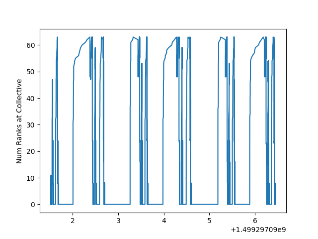

# sos_flow_experiments

This repository contains several examples that use SOS and/or TAU for runtime monitoring of parallel applications and workflows.

SOS has an optional dependency on EVPath. Several of the workflows use ADIOS.  For specific information on installing ADIOS and its dependencies (i.e. EVPath), see [https://www.olcf.ornl.gov/center-projects/adios/](https://www.olcf.ornl.gov/center-projects/adios/).  In the instructions below, the "CHAOS" path is the set of dependencies for ADIOS (EVPath, etc.)

# Building ADIOS for Pooky event extraction

When working with ADIOS applications, you should use this version of ADIOS (for now): [https://github.com/khuck/ADIOS](https://github.com/khuck/ADIOS).  It includes support for extracting the dimensions at each adios_write call.

NOTE:
You will also need to use this version of TAU (for now): [http://www.nic.uoregon.edu/~khuck/tau2-git-pooky.tar.gz](http://www.nic.uoregon.edu/~khuck/tau2-git-pooky.tar.gz).  

# Building SOS_flow

### To configure and install SOS (quick):

NOTE: Use this commit of SOS_flow: 45efaece03fc27348c93c8eff85206e068e070fd

```
git clone https://github.com/cdwdirect/sos_flow.git
cd sos_flow
git checkout 45efaece03fc27348c93c8eff85206e068e070fd
source hosts/linux/setenv.sh
./scripts/configure.sh -c
cd build-linux
make && make install
```

### To configure and build SOS (if quick doesn't work - modify as necessary to match your filesystem and compilers):

```
git clone https://github.com/cdwdirect/sos_flow.git
cd sos_flow
export CHAOS=$HOME/src/chaos/linux-gcc
export PKG_CONFIG_PATH=${CHAOS}/lib/pkgconfig:${PKG_CONFIG_PATH}
export LD_LIBRARY_PATH=${CHAOS}/lib:${LD_LIBRARY_PATH}
export PATH=${CHAOS}/bin:${ADIOS_ROOT}/bin:${PATH}
mkdir build
cd build
cmake -DCMAKE_BUILD_TYPE=RelWithDebInfo -DCMAKE_INSTALL_PREFIX=. -DCMAKE_C_COMPILER=gcc -DCMAKE_CXX_COMPILER=g++ -DSOSD_CLOUD_SYNC_WITH_EVPATH=TRUE -DSOSD_CLOUD_SYNC_WITH_MPI=FALSE -DMPI_C_COMPILER=mpicc -DMPI_CXX_COMPILER=mpicxx /gpfs/home/khuck/src/sos_flow/scripts/..
make && make install
```

# Building TAU and PDT

### Building PDT

One of the optional dependencies of TAU is PDT:

```
wget http://tau.uoregon.edu/pdt.tgz
tar -xvzf pdt.tgz
cd pdtoolkit-3.24
./configure -prefix=/usr/local/pdtoolkit/3.24
# this step may require sudo
make && make install
```

### Building TAU

To configure & build TAU, use this patched version of TAU: [http://www.nic.uoregon.edu/~khuck/tau2-git-pooky.tar.gz](http://www.nic.uoregon.edu/~khuck/tau2-git-pooky.tar.gz).  The paths to SOS and ADIOS are examples, please modify for your filesystem.

```
wget http://www.nic.uoregon.edu/~khuck/tau2-git-pooky.tar.gz
tar -xvzf http://www.nic.uoregon.edu/~khuck/tau2-git-pooky.tar.gz
cd tau2-git-pooky
./configure -adios=/home/khuck/src/chaos/adios/ADIOS-gcc -sos=/home/khuck/src/sos_flow/build-linux -pdt=/usr/local/packages/pdt/3.23 -mpi -pthread
```

# Building and Running an example

The example of interest is a coupled application that uses ADIOS to exchange data from one MPI application to another.  TAU will intercept the MPI and ADIOS events, and send the performance data to SOS, which will aggregate the data in a database.  After the example executes, we can post-process the database to extract the MPI collective periodicity.

### Building the example

The example of interest is in the "Junmin" directory of this repo.

```
cd Junmin
./build-linux.sh
```

The key change to building xmain and reader2 is that the TAU libraries need to be added *before* the ADIOS libraries in the link line.  TAU will perform the measurements, and send the TAU data to the SOS aggregator network.  See ImpactTv1betaAdios/Makefile.tau and readerFull/compile.tau for details:

```
ADIOS = $(shell tau_cc.sh -tau:showlibs) $(shell ${ADIOSDIR}/bin/adios_config -l -f)
```

### Running the example

```
mkdir testdir
# copy the executables
cp ImpactTv1betaAdios/xmain testdir
cp readerFull/reader2 testdir
# copy the run scripts/inputs
cp tiny/ImpactT.in testdir
cp tiny/small.r testdir
cd testdir
# modify small.r as necessary
sbatch small.r
```

### Postprocessing (for Pooky postprocessing, see below)

To extract the MPI collective periodicity from the SOS database, run a script in the SOS_flow repo (modify the path as necessary).  The script takes two arguments, the first is the name of the SOS database, and the second argument is the name of the application of interest (since the SOS database contains performance data from both applications):

```
python $HOME/src/sos_flow/src/soapy/compute-window-periodicity.py ./sosd.00000.db xmain
```

The script will open the database, perform queries and some analysis, and should eventually make output like this:

```
periodicity:  1.90189814568
compute duration, first arrival:  0.560921251774 , last arrival:  0.760286927223
last window: 
1499297094.66 to 1499297095.22
next 3 windows: 
1499297096.49 to 1499297097.05
1499297098.31 to 1499297098.87
1499297100.13 to 1499297100.69
Closing connection to database.
Done.
```

The script will also open a chart window that will look something like this:



### Postprocessing for Pooky:

Another script will also generate a YAML file with the MPI collective events and ADIOS events, to generate an ADIOS Skel/Diesel proxy application (TBD).  That script is executed like this:

```
./brute-force.py ./sosd.00000.db xmain
```

The script will open the database, perform queries and analysis, and out a YAML file that looks something like this:

```yaml
{ranks: 16, op_list: [{type: MPI_Cart_create, args: '(MPI_COMM_WORLD, 2, [4,4], [0,0],
        1)', name: MPI_COMM_WORLD, result: MPI_COMM_1}, {type: MPI_Cart_sub, args: '(MPI_COMM_1,
        [1,0])', name: MPI_COMM_1, result: MPI_COMM_2}, {type: MPI_Cart_sub, args: '(MPI_COMM_1,
        [0,1])', name: MPI_COMM_1, result: MPI_COMM_3}, {type: MPI_Comm_dup, args: (MPI_COMM_WORLD),
      name: MPI_COMM_WORLD, result: MPI_COMM_4}, {type: MPI_Comm_dup, args: (MPI_COMM_4),
      name: MPI_COMM_4, result: MPI_COMM_5}, {type: MPI_Barrier, comm: MPI_COMM_WORLD},
    {type: MPI_Reduce, num_bytes: 8, comm: MPI_COMM_WORLD}, {type: MPI_Reduce, num_bytes: 8,
      comm: MPI_COMM_WORLD}, {type: MPI_Barrier, comm: MPI_COMM_WORLD}, {type: MPI_Allreduce,
      num_bytes: 24, comm: MPI_COMM_WORLD}, {type: MPI_Barrier, comm: MPI_COMM_WORLD},
    {type: MPI_Allreduce, num_bytes: 24, comm: MPI_COMM_WORLD}, {type: MPI_Barrier,
      comm: MPI_COMM_WORLD}, {type: MPI_Allreduce, num_bytes: 48, comm: MPI_COMM_WORLD},
    {type: MPI_Allreduce, num_bytes: 4, comm: MPI_COMM_WORLD}, {type: MPI_Allreduce,
      num_bytes: 24, comm: MPI_COMM_1}, {type: MPI_Allreduce, num_bytes: 24, comm: MPI_COMM_1},
    {type: MPI_Barrier, comm: MPI_COMM_1}, {type: MPI_Barrier, comm: MPI_COMM_3},
    {type: MPI_Barrier, comm: MPI_COMM_2}, {type: MPI_Barrier, comm: MPI_COMM_3},
    {type: MPI_Barrier, comm: MPI_COMM_2}, {type: MPI_Allreduce, num_bytes: 4, comm: MPI_COMM_1},
    {type: MPI_Allreduce, num_bytes: 4, comm: MPI_COMM_1}, {type: MPI_Barrier, comm: MPI_COMM_1},
    {type: MPI_Barrier, comm: MPI_COMM_1}, {type: MPI_Barrier, comm: MPI_COMM_1},
    {type: MPI_Alltoallv, stats: '([4.000000,66560.000000,65536.000000,69632.000000,1108344832.000000],[4.000000,69632.000000,69632.000000,69632.000000,1212153856.000000])',
      comm: MPI_COMM_2}, {type: MPI_Alltoallv, stats: '([4.000000,66560.000000,65536.000000,69632.000000,1108344832.000000],[4.000000,70720.000000,69632.000000,73984.000000,1251217408.000000])',
      comm: MPI_COMM_2}, {type: MPI_Alltoallv, stats: '([4.000000,69632.000000,69632.000000,69632.000000,1212153856.000000],[4.000000,66560.000000,65536.000000,69632.000000,1108344832.000000])',
      comm: MPI_COMM_2}, {type: MPI_Barrier, comm: MPI_COMM_1}, {type: MPI_Barrier,
      comm: MPI_COMM_1}, {type: MPI_Barrier, comm: MPI_COMM_1}, {type: MPI_Barrier,
      comm: MPI_COMM_1}, {type: MPI_Barrier, comm: MPI_COMM_1}, {type: compute, time: '0.130429983139'},
    {type: MPI_Allreduce, num_bytes: 4, comm: MPI_COMM_WORLD}, {type: MPI_Allreduce,
      num_bytes: 4, comm: MPI_COMM_WORLD}, {type: adios phase, bp_file: pookie_extraction.bp,
      comm: MPI_COMM_WORLD, vars: [{name: NBunch, type: adios_integer, local_dims: '',
          value: 1}, {name: NX00001, type: adios_integer, local_dims: '', value: 6},
        {name: NY00001, type: adios_integer, local_dims: '', value: 2000000}, {name: GX00001,
          type: adios_integer, local_dims: '', value: 6}, {name: GY00001, type: adios_integer,
          local_dims: '', value: 32000000}, {name: OX00001, type: adios_integer, local_dims: '',
          value: 0}, {name: OY00001, type: adios_integer, local_dims: '', value: 0},
        {name: particles00001, type: adios_double, local_dims: '[[NX00001,NY00001]',
          global_dims: '[GX00001,GY00001]', local_offsets: '[OX00001,OY00001]]'}]}]}
```

